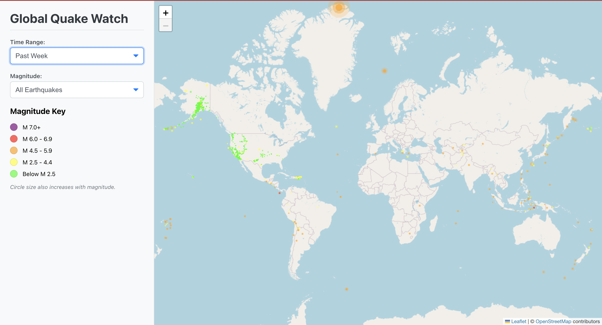

# Real-Time Earthquake Visualizer 🗺️

This project is an interactive web application that visualizes real-time global earthquake activity. It fetches data from the USGS GeoJSON feed and plots the events on an interactive Leaflet map, allowing users to explore seismic patterns in an intuitive way.

### **Live Demo**
https://globalquakewatch.netlify.app/



---
## **Features**

* **Interactive Map:** Utilizes Leaflet to display a zoomable and pannable world map.
* **Real-Time Data:** Fetches and displays the latest earthquake data directly from the USGS API.
* **Dynamic Visualization:**
    * The **size** of each circle marker corresponds to the earthquake's **magnitude**.
    * The **color** of each marker represents the event's potential surface **intensity** (a ratio of magnitude to depth).
* **User-Friendly Filters:** Allows users to filter earthquakes by time range (past hour, day, week, month) and magnitude.
* **Detailed Information:** Clickable pop-ups on each earthquake provide details like location, magnitude, depth, and time.

---
## **Tech Stack**

* **Frontend:** React.js
* **Mapping:** Leaflet & React-Leaflet
* **Data Source:** USGS Real-time GeoJSON Feeds
* **Styling:** CSS3

---
## **Getting Started**

To get a local copy up and running, follow these simple steps.

### **Prerequisites**
You will need Node.js and npm installed on your machine.

### **Installation**
1.  Clone the repo
    ```sh
    git clone [https://github.com/your_username/your_repository_name.git](https://github.com/your_username/your_repository_name.git)
    ```
2.  Navigate to the project directory
    ```sh
    cd your_repository_name
    ```
3.  Install NPM packages
    ```sh
    npm install
    ```
4.  Start the development server
    ```sh
    npm start
    ```
    The application will be running on `http://localhost:3000`.

